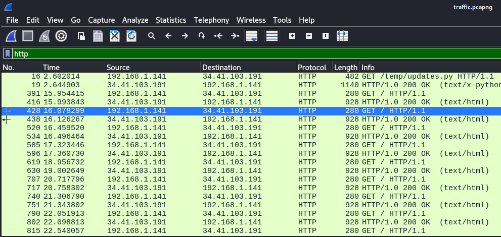

Bước 1: Initial Analysis
Bước đầu tiên là mở file traffic.pcapng bằng Wireshark. Do đề bài nhắc đến lưu lượng mạng bất thường, mình tập trung vào các giao thức tầng ứng dụng.

Ở đây ta thấy địa chỉ ip local giao tiếp tuần tự với 1 ip public trong mạng và có lấy 1 file python
Bước 2: Export HTTP Objects
Trong các object xuất hiện có một file Python.
Sau khi export, thu được đoạn mã:

Ta thấy đây là file key logger, được mã hóa bằng xor. 
Khóa được tạo từ:
p1 = "H0t3lSt@ff0Nly"
p2 = "K3epS3cr3t!"
Thay vì gửi trong URL hay POST body, malware giấu dữ liệu trong HTTP Cookie:
hotel_sess_state=<Base64(XOR(character))>
Bước 3: Lấy dữ liệu được giấu bằng Tshark

tshark -r traffic.pcapng \
-Y "http.cookie contains hotel_sess_state" \
-T fields \
-e http.cookie

Bước 4: Giải mã lại dữ liệu bằng python để lấy flag.
Do malware sử dụng: 
Plaintext
↓
XOR
↓
Base64
↓
Cookie

Ta thực hiện ngược lại:
Cookie
↓
Base64 Decode
↓
XOR cùng key
↓
Original Character

